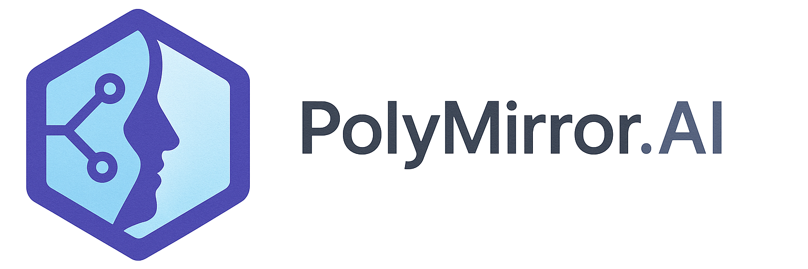

# PolyMirror.AI: Pay for AI with Polygon

Submission for the `Polygon Track` at the `Vibe Coding Hackathon` 2025 organised by the `Encode Club`.

<p align="center">
  
</p>

## Executive Summary

Sam is a DeFi dev building a trading agent on Polygon. Local models are too slow for volatile crypto markets, but cloud AI services require credit cards and create administrative hurdles for a DAO or a project.

What if Sam could use a simple "mirror" service to:

1.  **Deposit `POL`** into a dedicated on-chain payment channel.
2.  **Send API requests** with a tiny, gasless, ECDSA-signed `Voucher`.
3.  **Get a real-time AI response**, while the backend claims the *exact* cost from the voucher later (in batches to save gas).
4.  **Top up the balance** with a single transaction when it runs low.

No banks, no paperwork, just pure on-chain pay-per-use AI. That's PolyMirror.AI.

## How It Was Developed

This project was developed as part of the `Vibe Coding Hackathon`, with a strong focus on using AI as a development partner. The idea was to develop a full stack web3 application to demonstrate how far can AI-assisted development go in a short time frame.

-   **IDE**: VSCode with GitHub Copilot
-   **AI Model**: Google's Gemini 2.5 Pro
-   **Process**: The entire development process was conversational. We started with a high-level concept and iteratively built out the smart contract, backend, and frontend. Gemini assisted with writing and debugging code, creating configuration files, writing tests, and even generating the content for this README.

## Project Structure

The project is a monorepo located in the `/mirror` directory, containing:

-   `contracts/`: The core `PolyMirrorChannel.sol` smart contract for POL-based payment channels.
-   `scripts/`: Hardhat scripts for deploying the contract.
-   `test/`: Tests for the smart contract.
-   `backend/`: A Node.js/Express server that acts as a proxy to the OpenAI API. It handles voucher verification, cost calculation, on-chain redemption, and stores usage data in a PostgreSQL database using Prisma.
-   `frontend/`: A React/Vite dashboard for users to manage their payment channel (top-up/withdraw), view their transaction history, and see usage analytics.
-   `chatbot/`: A simple Python-based chatbot UI to demonstrate how a client application would use the PolyMirror.AI backend.
  

## Workflow: From Top-up to AI Completion

1.  **User Connects Wallet**: The user connects their MetaMask wallet (on Polygon Amoy testnet) to the frontend dashboard.
2.  **Channel Top-up**: The user deposits POL into the `PolyMirrorChannel` smart contract, creating or funding their payment channel. The balance is now visible on the dashboard.
3.  **API Request & Voucher Signing (from any client)**: A client application (like the provided chatbot) needs to make an OpenAI API call.
    -   It defines the request parameters, including the exact `inputTokenAmount` and a `maxOutputTokenAmount` it's willing to pay for.
    -   It creates an **EIP-712 typed data voucher** containing the payment authorization: `(channel, nonce, deadline, model, inputTokenAmount, maxOutputTokenAmount)`.
    -   The user's wallet signs this voucher, producing a `signature`. This signature proves the user authorized a payment up to the cost of the specified tokens.
    -   The client sends the OpenAI request to the PolyMirror backend, with the `voucher` and `signature` in the `Authorization: Bearer` header (Base64 encoded).
4.  **Backend Processing**:
    -   The backend receives the request and decodes the voucher.
    -   It simulates the `redeem` call on-chain to verify the voucher's validity (nonce, deadline) and signature *before* calling OpenAI. This prevents wasted API calls.
    -   It forwards the request to the actual OpenAI API.
5.  **Cost Calculation & Redemption**:
    -   OpenAI returns the completion along with the *actual* number of `input` and `output` tokens used.
    -   The backend calculates the *exact cost* in POL based on the model's pricing. It verifies that the actual `output` tokens are less than or equal to the `maxOutputTokenAmount` signed in the voucher, and that the user has sufficient funds.
    -   It then calls the `redeem` function on the smart contract. This architecture is designed to be highly gas-efficient, as the backend can collect many signed vouchers and redeem them later in a single batch transaction. *(To simplify the PoC, the current implementation redeems each voucher immediately after the API call.)*
    -   The contract validates the signature and transfers the exact cost from the user's channel to the service owner's wallet.
6.  **Response & Data Logging**:
    -   The backend saves a record of the transaction (model, tokens used, cost) to the PostgreSQL database.
    -   The original OpenAI completion is streamed back to the client.
7.  **Dashboard Update**: The user can see their channel balance decrease and the new transaction appear in their history on the frontend dashboard in near real-time.

## Demo: Running the Full Stack

Follow these steps to get the entire PolyMirror.AI application running locally.

### 1. Prerequisites

-   **Node.js** (v18+)
-   **pnpm** (or npm/yarn)
-   **Docker** and **Docker Compose**
-   **MetaMask** browser extension

### 2. Initial Setup

```bash
# Clone the repository
git clone <repository_url>
cd PolyMirror.AI/mirror

# Install root, backend, and frontend dependencies
pnpm install
cd backend && pnpm install && cd ..
cd frontend && pnpm install && cd ..
```

### 3. Environment Configuration

Create a `.env` file in the `/mirror` directory by copying the example file.

```bash
cp .env.example .env
```

Now, fill in the variables in your new `.env` file:

-   `AMOY_RPC_URL`: Your RPC endpoint for the Polygon Amoy testnet (e.g., from Alchemy or Infura).
-   `OWNER_PRIVATE_KEY`: The private key of the account that will own the contract and receive payments. This is your **backend wallet**.
-   `USER_PRIVATE_KEY`: The private key of a test user account. This is your **frontend/client wallet**.
-   `OPENAI_API_KEY`: Your OpenAI API key.
-   `DATABASE_URL`: The connection string for the PostgreSQL database. The default value is configured for the Docker setup and doesn't need to be changed.
-   `VITE_CONTRACT_ADDRESS`: This will be filled in after you deploy the contract.

**IMPORTANT**: Both the `OWNER` and `USER` accounts need **Amoy POL** to pay for gas. You can get some from the official [Polygon Faucet](https://faucet.polygon.technology/).

### 4. Start the Database

Run the PostgreSQL database in a Docker container.

```bash
# From the /mirror/backend directory
cd backend
docker-compose up -d

# Run Prisma migration to create the database schema
pnpm prisma migrate dev --name init
```

### 5. Deploy the Smart Contract

Deploy the `PolyMirrorChannel` contract to the Amoy testnet.

```bash
# From the /mirror directory
cd ..
npx hardhat run scripts/deploy.js --network amoy
```

The script will print the deployed contract address. **Copy this address and paste it** into your `.env` file for the `VITE_CONTRACT_ADDRESS` variable.

### 6. Run the Application

Open three separate terminal windows, all in the `/mirror` directory.

-   **Terminal 1: Start the Backend**

    ```bash
    cd backend
    pnpm start
    ```

-   **Terminal 2: Start the Frontend**

    ```bash
    cd frontend
    pnpm dev
    ```

-   **Terminal 3: Use the Chatbot Client**

    ```bash
    # Set up the chatbot environment (only needs to be done once)
    cd chatbot
    python -m venv venv
    source venv/bin/activate
    pip install -r requirements.txt

    # Run the chatbot UI
    python chatbot_ui.py
    ```

### 7. Using the App

1.  **Open the Frontend**: Navigate to `http://localhost:3000` in your browser.
2.  **Configure MetaMask**: Import your `USER_PRIVATE_KEY` into MetaMask and ensure you are connected to the Polygon Amoy network.
3.  **Connect & Top-up**: Click "Connect Wallet" and then use the "Top-up" button to deposit some Amoy POL into your payment channel.
4.  **Chat!**: Open the Chatbot UI (it will launch in your browser). Start a conversation. The chatbot uses the backend proxy, which will use your on-chain funds.
5.  **View Results**: Watch your transaction history and usage analytics update in real-time on the dashboard.

## Disclaimer (IMPORTANT!)

The code is a working Proof of Concept using OpenAI's API as an example. Using this code to circumvent OpenAI's terms of service is a violation of their policies. This project is intended for educational and demonstration purposes only, showcasing a novel payment mechanism for Web3. Any misuse is not the responsibility of the developers.